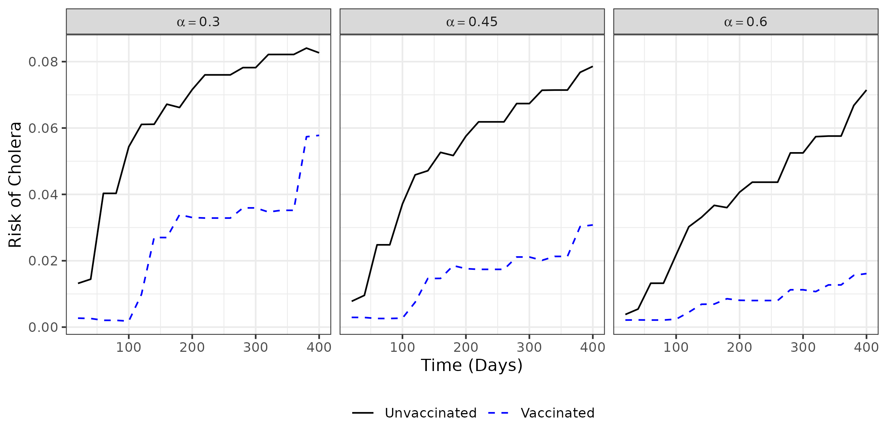
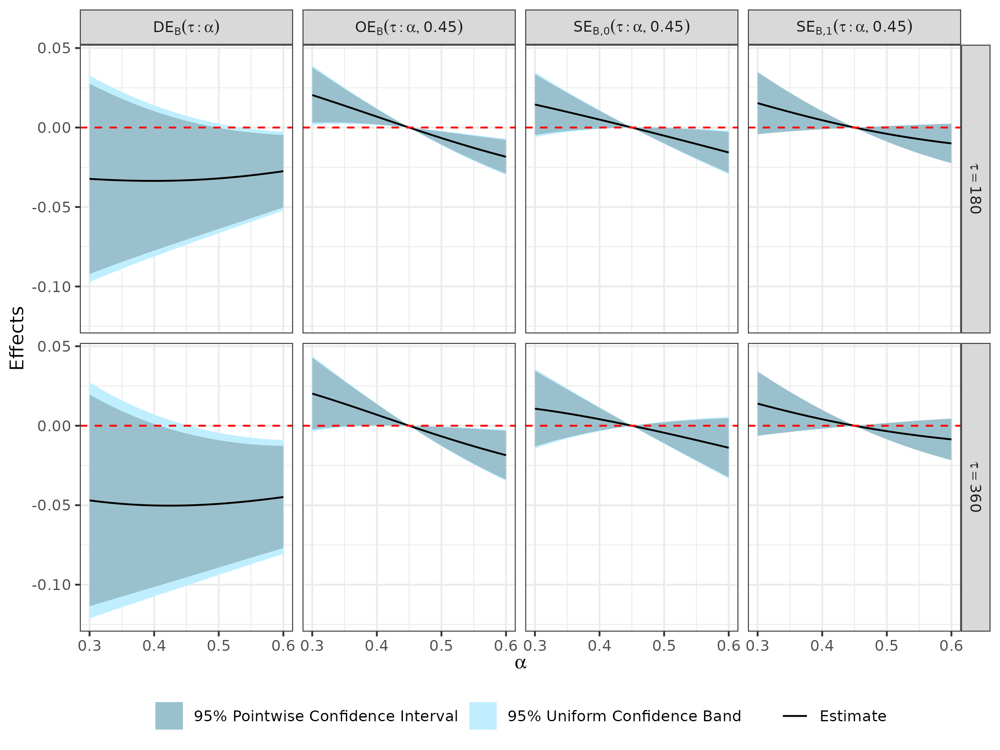

# NPSACI

This repository contains the code accompanying the paper: **Nonparametric Causal Survival Analysis with Clustered Interference**

We develop nonparametric cross-fitting estimators for causal survival effects under clustered interference and right censoring.

---

## 📦 Quick Start

Run `QuickStart.R` to replicate a minimal example.

### Step 1: Prepare the dataset

Your dataset should contain the following variables:

* `id`: cluster ID
* `Y`: observed time
* `D`: event indicator (`D = I(T ≤ C)`)
* `A`: binary treatment
* `X`: covariates (any column names)

Here is a synthetic data generator:

```r
library(dplyr)
library(glue)
library(doMC)
library(randomForestSRC)
library(dbarts)
library(conflicted)
conflicts_prefer(dplyr::filter)

generate_cluster_data = function(N) {
  age <- round(runif(N, 15, 65))
  dist.river <- runif(N, 0, 5)
  b <- rnorm(1, 0, 0.5)
  pi <- plogis(0.2 + 0.2*(age/40 - 1)^2 + 0.2*pmax(dist.river/5, 0.3) + b)
  A <- rbinom(N, 1, pi)
  g.A <- (sum(A) - A) / (N - 1)
  T_ <- round(100 * rexp(N, 1 / exp(2 + A + g.A + A * g.A + 0.5 * dist.river - 0.5 * (age/40 - 1))))
  C <- round(runif(N, 0, 500 + 200 * A + 50 * dist.river + 100 * (age/40 - 1)))
  Y <- pmin(T_, C)
  D <- as.numeric(T_ <= C)
  data.frame(Y = Y, D = D, A = A, age = age, dist.river = dist.river)
}

m <- 200
toy_data <- lapply(sample(3:5, m, replace = TRUE), generate_cluster_data) %>%
  bind_rows(.id = "id") %>% mutate(id = as.numeric(id))
```

### Step 2: Estimate causal effects

Set parameters for nuisance models and target estimands:

* `X.T.names`: covariates used in the survival time model (`T`)
* `X.C.names`: covariates used in the censoring time model (`C`)
* `X.A.names`: covariates used in the treatment assignment model (`A`)
* `policy`: treatment allocation policy, either `"TypeB"` or `"TPB"`
* `taus`: time points of interest for survival analysis
* `thetas`: policy indices for which causal effects are estimated
* `theta0`: baseline policy index for causal effect comparison


```r
# --- Compute estimates ---

## Help functions for estimator main functions
source("code/help_util.R")

## Help functions for policy specific functions
source("code/help_TypeB.R")
source("code/help_TPB.R")

## Help functions for nuisance functions estimation method
source("code/help_nuis_est.R")

## Compute estimates
result <- estimator(
  data = toy_data,
  X.T.names = c("age", "dist.river"),
  X.C.names = c("age"),
  X.A.names = c("age", "dist.river"),
  policy = "TypeB",
  taus = 20 * (1:20),
  thetas = seq(0.3, 0.6, length.out = 31),
  theta0 = 0.45,
  parallel_computing = FALSE
)

## Estimation Result
result$result %>% 
  filter(estimand == "mu", tau == 360) %>% 
  mutate(dplyr::across(c(est, se, PCL, PCU, UCL, UCU), ~ round(.x, 4)))
  
      estimand theta tau    est     se    PCL    PCU    UCL    UCU
#> 1        mu  0.30 360 0.0675 0.0232 0.0219 0.1130 0.0174 0.1175
#> 2        mu  0.31 360 0.0662 0.0225 0.0221 0.1103 0.0177 0.1147
#> 3        mu  0.32 360 0.0650 0.0218 0.0222 0.1077 0.0180 0.1119
#> 4        mu  0.33 360 0.0637 0.0211 0.0223 0.1050 0.0182 0.1091
#> 5        mu  0.34 360 0.0623 0.0204 0.0224 0.1023 0.0184 0.1063
#> 6        mu  0.35 360 0.0610 0.0197 0.0223 0.0997 0.0185 0.1035
#> 7        mu  0.36 360 0.0597 0.0191 0.0223 0.0970 0.0186 0.1007
#> 8        mu  0.37 360 0.0583 0.0184 0.0222 0.0944 0.0186 0.0980
#> 9        mu  0.38 360 0.0569 0.0178 0.0221 0.0918 0.0186 0.0953
#> 10       mu  0.39 360 0.0555 0.0172 0.0219 0.0892 0.0185 0.0926
```

**Result Columns**:

* `est`: estimated causal effect
* `se`: estimated standard error
* `PCL`/`PCU`: 95% **pointwise** confidence interval (L: lower, U: upper)
* `UCL`/`UCU`: 95% **uniform** confidence band (L: lower, U: upper)


### Step 3: Visualize estimates
```r
estimates = result$result %>% mutate(theta = round(theta, 4))

## Risk over time plot
thetas = c(0.3, 0.45, 0.6)

ggplot(data = estimates %>%
         filter(estimand %in% c("mu_1", "mu_0")) %>%
         filter(theta %in% thetas) %>%
         mutate(theta = paste0("alpha == ", theta)),
       aes(x = tau, y = est, group = estimand, color = estimand)) +
  geom_line(aes(linetype = estimand)) +
  facet_grid(. ~ theta, labeller = label_parsed) +
  labs(x = "Time (Days)", y = "Risk of Cholera") +
  scale_linetype_manual(values = c("mu_0" = "solid", "mu_1" = "dashed"),
                        labels = c("mu_0" = "Unvaccinated", "mu_1" = "Vaccinated"),
                        guide = guide_legend(title = NULL)) +
  scale_color_manual(values = c("mu_0" = "black", "mu_1" = "blue"),
                     labels = c("mu_0" = "Unvaccinated", "mu_1" = "Vaccinated"),
                     guide = guide_legend(title = NULL)) +
  theme_bw() +
  theme(legend.position = "bottom")


## Effects over theta plot
times = c(180,360)

ggplot(estimates %>%
         dplyr::filter(estimand %in% c("de", "se_1", "se_0", "oe")) %>%
         dplyr::mutate(estimand = factor(estimand, levels = c("de", "oe", "se_0", "se_1"))) %>%
         dplyr::filter(tau %in% times) %>%
         mutate(tau = factor(paste0("tau == ", tau), levels = paste0("tau == ", times))),
       aes(x = theta, y = est)) +
  geom_ribbon(aes(ymin = UCL, ymax = UCU, fill = "95% Uniform Confidence Band"), alpha = 1) +
  geom_ribbon(aes(ymin = PCL, ymax = PCU, fill = "95% Pointwise Confidence Interval"), alpha = 1) +
  geom_line(aes(color = "Estimate"), linewidth = 0.5) +
  geom_hline(data = expand.grid(estimand = c("de", "se_1", "se_0", "oe")),
             aes(yintercept = 0), color = "red", linetype = "dashed") +
  facet_grid(tau ~ estimand, labeller = labeller(
    estimand = as_labeller(
      c("mu"   = "mu['B'](alpha)",
        "mu_1" = "mu['B,1'](alpha)",
        "mu_0" = "mu['B,0'](alpha)",
        "de"   = 'DE["B"](tau:alpha)',
        "se_1" = 'SE["B,1"](tau:alpha,0.45)',
        "se_0" = 'SE["B,0"](tau:alpha,0.45)',
        "oe"   = 'OE["B"](tau:alpha,0.45)'),
      label_parsed
    ),
    tau = label_parsed
  )) +
  scale_fill_manual(name = NULL,
                    values = c("95% Pointwise Confidence Interval" = "lightblue3",
                               "95% Uniform Confidence Band" = "lightblue1"),
                    guide = guide_legend(title = NULL)) +
  scale_color_manual(name = NULL,
                     values = c("Estimate" = "black"),
                     guide = guide_legend(title = NULL)) +
  labs(x = expression(alpha), y = "Effects") +
  theme_bw() +
  theme(legend.position = "bottom",
        legend.background = element_blank(),
        legend.key = element_blank())
```

### Risk of Cholera over Time


### Effects over Vaccine Coverage


---

## 📁 Repository Structure

### `/code`

Core functions for estimation:

* `help_util.R`: main estimation workflow
* `help_TypeB.R`: policy-specific functions (TypeB)
* `help_TPB.R`: policy-specific functions (TPB)
* `help_nuis_est.R`: nuisance parameter estimation

### `/simulation`

Scripts (.R) and HPC SLURM files (.sh) for simulation studies:

* `help_simul.R`: simulation settings
* `estimand.R`: computes target estimands
* `estimator.R`: computes estimators
* `readresult.R`: reads and summarizes outputs

**Subfolders:**

* `estimand/`: saved estimands ⚠️ **Outputs (.rds files) not included due to repo size limit.**
* `estimate/`: saved estimates ⚠️ **Outputs (.rds files) not included due to repo size limit.**

**Main Simulations in paper**

* **Performance under TypeB policy** (Table 3)
  
  :page_facing_up: `M.main_simulation/estimator.R`
  
  *Settings*: `policy = "TypeB"`, `m = 200`, `r = 100`

* **Proposed vs. IPCW estimators** (Figure 1)
  
  :page_facing_up: `M.main_simulation/estimator_chakladar.R`
  
  Compares the proposed estimator to the IPCW estimator by [Chakladar et al. (2021)](https://doi.org/10.1111/biom.13459)

**Supplementary Simulations**

* **Section C.1** – Performance under TPB policy (Table S1)
  
  :page_facing_up: `M.main_simulation/estimator.R`

  *Settings*: `policy = "TPB"`, `m = 200`, `r = 100`

* **Section C.2** – Performance over number of clusters *m* (Figure S1)

  :page_facing_up: `M.main_simulation/estimator.R`

  *Settings*: `policy = "TypeB"`, `m ∈ {25, 50, 100, 200, 400}`, `r = 100`

* **Section C.3** – Bounded vs. unbounded estimators (Figure S2)

  :page_facing_up: `M.main_simulation/estimator_unbounded.R`

  Evaluates estimators without the bounding modification

* **Section C.4** – Performance over subsampling degree *r* (Figure S3)

  :page_facing_up: `M.main_simulation/estimator.R`

  *Settings*: `policy = "TypeB"`, `m = 200`, `r ∈ {10, 20, 50, 100, 200, 500}`

* **Section C.5** – Performance under different correlation structures in treatment assignment (Figure S4)

  :file_folder: `C5.sigmab_experiment`

  Varies treatment correlation `σ_b = corr(A_ij, A_ik)`

* **Section C.6** – Performance under different cluster size distributions (Figure S5):

  :file_folder: `C6.Ndist_experiment`

  Varies distribution of cluster sizes `N_i`

* **Section C.7** – Performance over high censoring rates (Figure S6):

  :file_folder: `C7.high_censoring_experiment`

  Varies censoring rates 40%, 50%, 60%, 70%, 80%, 90%

* **Section C.8** – Convergence of nuisance function estimators (Figure S7):

  :file_folder: `C8.nuis_converge`

  L_2(P) error of nonparametric and parametric nuisance function estimators over `m ∈ {50, 100, 200, 400, 800, 1600}`

* **Section C.9** – Performance under small number of clusters but large cluster size (Figure S8):

  :file_folder: `C9.smallm_largeN_experiment`

  Number of clusters is small (`m = 10`) but cluster sizes are large (`N_i ∈ {100, 300, 500, 700, 900}`)

* **Section C.10** – Performance of non-interference nonparametric survival estimators (Figure S9):

  :file_folder: `C10.no_interference_surv_est`

  Comparison of the proposed estimator with non-interference methods including
causal survival forest (CSF) ([Cui et al. 2023](https://doi.org/10.1093/jrsssb/qkac001)), Multiple Imputation for Survival Treatment Response (MISTR) ([Meiret al. 2025](https://arxiv.org/abs/2502.01575)), and random survival forest with T-learner and X-learner ([Bo et al. 2024](https://jds-online.org/journal/JDS/article/1354/info)). 

### `/application`

Cholera vaccine effect analysis under clustered interference.
⚠️ **Raw data and outputs not public.**

* `preprocessing.R`: preprocessing + exploratory analysis (Figures S10–S12)
* `estimator.R`: causal estimation
* `visualization.R`: plotting (Figures 2–3, S13–S15)

### `/application_example`

Toy example replicating the application pipeline.

* `generate_toy_data.R`: create synthetic dataset
* `estimate/`: results using toy dataset

---